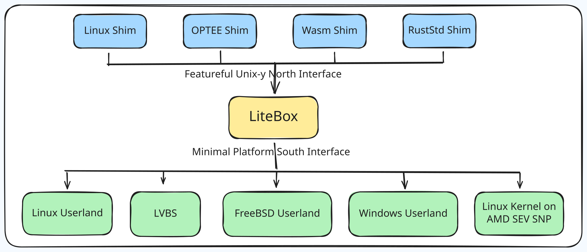

# LiteBox

> A security-focused library OS

> [!NOTE]  
> This project is currently actively evolving and improving. While we are
> working toward a stable release, some APIs and interfaces may change as the
> design continues to mature. You are welcome to explore and experiment, but if
> you need long-term stability, it may be best to wait for a stable release, or
> be prepared to adapt to updates along the way.

LiteBox is a sandboxing library OS that drastically cuts down the interface to the host, thereby reducing attack surface.  It focuses on easy interop of various "North" shims and "South" platforms.  LiteBox is designed for usage in both kernel and non-kernel scenarios.

LiteBox exposes a Rust-y [`nix`](https://docs.rs/nix)/[`rustix`](https://docs.rs/rustix)-inspired "North" interface when it is provided a `Platform` interface at its "South".  These interfaces allow for a wide variety of use-cases, easily allowing for connection between any of the North--South pairs.

Example use cases include:
- Running unmodified Linux programs on Windows
- Sandboxing Linux applications on Linux
- Run programs on top of SEV SNP
- Running OP-TEE programs on Linux
- Running on LVBS

## This build: real interactive Linux shells on Windows

This checkout carries a set of fixes on top of upstream LiteBox that make the
`litebox_runner_linux_on_windows_userland` target usable as a genuine,
interactive Linux userland on Windows -- not just for running a single
non-interactive command, but for driving a real shell session the way a human
would: typing at a prompt, running `apk`/package-manager workflows, and using
REPLs like Node's that depend on raw-mode terminal I/O, job control, and
correct multithreaded stdio.

Concretely, this build fixes (all landed on `main`, CI-verified):

- **Real interactive keyboard input.** Typed keystrokes are now correctly
  delivered to the guest shell instead of being silently dropped or hanging
  the process (a missing epoll wakeup path and a Windows console
  cooked-mode/CPR-reply bug).
- **`setRawMode`/raw terminal mode** (used by Node's REPL, `less`, `vim`,
  Python's `readline`, and any program that manages its own line editing) no
  longer crashes with `ENOTTY`.
- **Job control.** `TIOCSPGRP`/`TIOCGPGRP` are implemented, so shells no
  longer fall back to `can't access tty; job control turned off`.
- **A deep, multi-stage `fork()` correctness fix on Windows.** LiteBox
  duplicates a forked child's address space to new host addresses (Windows
  can't give two "processes" the same addresses in one host process), which
  left a class of stale, untranslated pointers reachable after `fork()` --
  fixed for both code pages (a `STATUS_PRIVILEGED_INSTRUCTION` crash on
  chained shell commands) and argv/data pointers (intermittent, and in one
  case perfectly deterministic per-command-length, corruption of a freshly
  exec'd command's arguments).
- **`chmod`/`fchmod`/`fchmodat`, `utimensat`/`futimens`, and `flock`**, which
  were previously unimplemented (`ENOSYS`) despite the underlying filesystem
  layer already supporting them.
- **A real userspace NAT gateway** for guest network access on Windows,
  needing neither Administrator privileges nor a driver, so `apk`/`curl`/etc.
  can reach the real network.
- **Multithreaded process correctness**: a lost-wakeup race in `poll()`, an
  unbounded UDP NAT flow leak, orphan-process reparenting, a process-exit fd
  leak that could hang pipe readers, and a missing `FUTEX_REQUEUE`
  implementation that could deadlock a multithreaded guest process (e.g.
  Node/V8) on exit.
- **Concurrent stdio correctness**: guest writes to stdout/stderr from
  different threads of the same process (as V8/libuv do heavily) are now
  serialized, so output from one thread can no longer be spliced mid-write
  into another thread's output.
- **Missing syscalls that real-world programs call in practice**:
  `sched_getparam`/`sched_setparam`/`sched_getscheduler`/`sched_setscheduler`,
  and `clock_gettime`/`clock_getres` support for
  `CLOCK_PROCESS_CPUTIME_ID`/`CLOCK_THREAD_CPUTIME_ID`/`CLOCK_MONOTONIC_RAW`/
  `CLOCK_REALTIME_COARSE`/`CLOCK_BOOTTIME` (V8's own startup code aborts the
  whole process if `clock_gettime` returns an error, which it previously did
  for these clock IDs).
- **`setrlimit`/`prlimit64` correctness.** Calling `setrlimit`/`prlimit64` for
  any resource other than `RLIMIT_NOFILE` (e.g. `ulimit -c 0`, which is
  extremely common in shell entrypoint scripts) used to panic and crash the
  whole runner; it's now accepted for every resource. Separately,
  `RLIMIT_SIGPENDING` -- which is actually enforced, unlike most rlimits --
  defaulted to a limit of `0`, silently dropping every real-time/queued
  signal a guest process sent; it now defaults to a realistic Linux value.
- **Baked-in agent-sandbox tooling.** The published Alpine base image now
  also includes `git`, `bash`, `curl`, `openssh-client`, and `tzdata`
  alongside `nodejs`/`npm`/`python3`/`py3-pip`/`build-base`, so common
  agent-workload needs (cloning a repo, running a `#!/bin/bash` npm
  postinstall script, fetching a file, using Python's `zoneinfo` for
  anything timezone-aware -- Alpine/musl doesn't ship timezone data by
  default) don't require an extra `apk add` round-trip.
- **Unix98 pseudoterminal (pty) support.** `/dev/ptmx`, `TIOCGPTN`,
  `TIOCSPTLCK` (`unlockpt`), and `/dev/pts/<id>` now work, with real duplex
  master/slave byte forwarding and shared `termios`/window-size/foreground-
  pgid state -- previously `TIOCGPTN` unconditionally returned `ENOTTY` and
  there was no pty subsystem at all. This is what lets `node-pty`,
  `pexpect`/`ptyprocess`, `tmux`, and `script` allocate and drive a pty
  inside the guest. Input-side line discipline (kernel-side canonical-mode
  input buffering, echo, ^C/^Z/^\ signal generation) is not implemented --
  every consumer that puts the pty into raw mode itself (which is what all
  of the above do) is unaffected, but a guest shell relying on the kernel
  to echo typed characters back in cooked mode will not see that echo.
  Output-side processing is partially implemented: a fresh pty defaults to
  `OPOST|ONLCR` (matching real Linux), so a plain `\n` written by an
  ordinary program that doesn't manage its own raw mode (`ls`, `git log`,
  a Python script's `print()`) comes out `\r\n` on the master side --
  without this, any real terminal UI reading the master (VS Code's pty
  panel, ttyd/wetty, xterm.js) would render that output as an unreadable
  "staircase".
- **`setsid()` and `TIOCSCTTY`.** These were entirely missing -- `setsid()`
  wasn't implemented as a syscall at all, and `TIOCSCTTY` fell through to a
  hard `EINVAL`. Since glibc's `login_tty()` (the primitive under
  `forkpty()`/`openpty()`-based tools -- `node-pty`, Python's
  `os.forkpty()`, tmux, `script`) always calls exactly this pair right after
  `fork()`, this was a hard failure at session-open time for every one of
  the tools the pty support above exists to serve, not just a degraded-
  behavior gap. Both are implemented now.
- **Three more crash-on-ordinary-usage panics fixed.** `readlink("/proc/self/fd/<N>")`
  crashed the whole runner for any fd other than 0/1/2 (hit by e.g. Python's
  `os.readlink(f"/proc/self/fd/{fd}")`, used by introspection/sandboxing
  libraries); a single `read()` of more than 512KiB from a pipe/socket/pty
  crashed the runner (hit by e.g. reading a subprocess's stdout in one large
  read); and `mmap(MAP_SHARED | PROT_WRITE)` on a file-backed fd crashed the
  runner (hit by e.g. Python's `mmap.mmap(fd, len, mmap.MAP_SHARED,
  mmap.PROT_WRITE)`). All three now return the correct errno instead of
  panicking.
- **`fork()` now inherits the parent's rlimits.** Every freshly forked
  child used to get program-start default resource limits regardless of
  what the parent had configured via `setrlimit()` beforehand -- so a
  supervisor process that lowered e.g. `RLIMIT_NOFILE` before spawning a
  child got a child that silently wasn't bounded by it. `fork()`/`clone()`
  now copies the parent's current limits into the child, matching real
  Linux.
- **`kill(0, sig)` / `kill(-pgid, sig)` / `kill(-1, sig)` no longer hard-fail.**
  `kill()` has no registry of other live guest processes to deliver to (a
  genuinely open architectural gap -- see below), but these three forms
  target the caller's own process group or "everyone the caller may
  signal," and self is always a real member of all three sets. Previously
  they failed with `ESRCH` unconditionally, even in the common case of a
  script signaling its own group during cleanup; they now deliver to self,
  which is exactly correct whenever no other process happens to share the
  group. A genuine remote pid (some specific *other* process) still
  correctly fails, since actually reaching one isn't implemented.

A ready-to-run bundle (the Windows runner exe plus a packaged Alpine rootfs)
is built by [`.github/workflows/release-windows-alpine.yml`](.github/workflows/release-windows-alpine.yml).

## Contributing

See the following files for details:

- [CONTRIBUTING.md](./CONTRIBUTING.md)
- [CODE_OF_CONDUCT.md](./CODE_OF_CONDUCT.md)
- [SECURITY.md](./SECURITY.md)
- [SUPPORT.md](./SUPPORT.md)

## License

MIT License.  See [./LICENSE](./LICENSE) for details.

## Trademarks

This project may contain trademarks or logos for projects, products, or services. Authorized use of Microsoft 
trademarks or logos is subject to and must follow 
[Microsoft's Trademark & Brand Guidelines](https://www.microsoft.com/en-us/legal/intellectualproperty/trademarks/usage/general).
Use of Microsoft trademarks or logos in modified versions of this project must not cause confusion or imply Microsoft sponsorship.
Any use of third-party trademarks or logos are subject to those third-party's policies.
